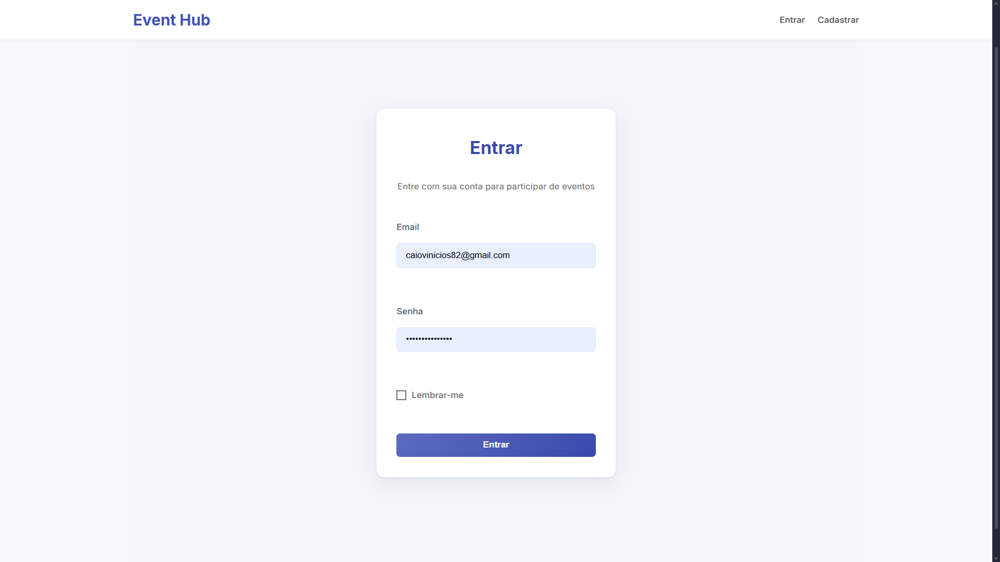
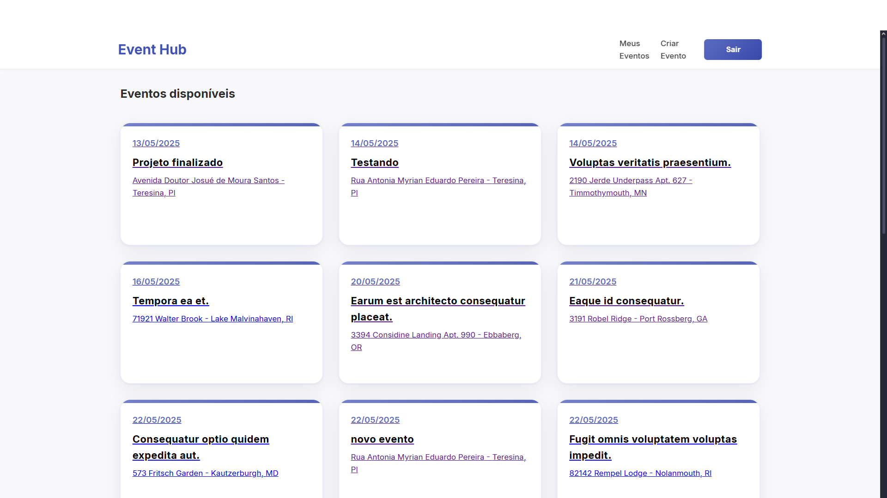
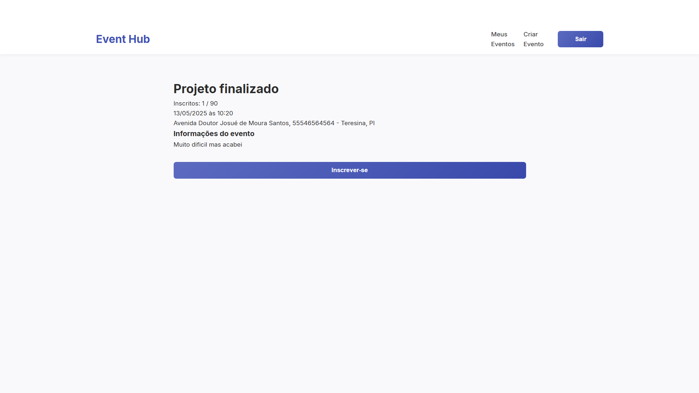
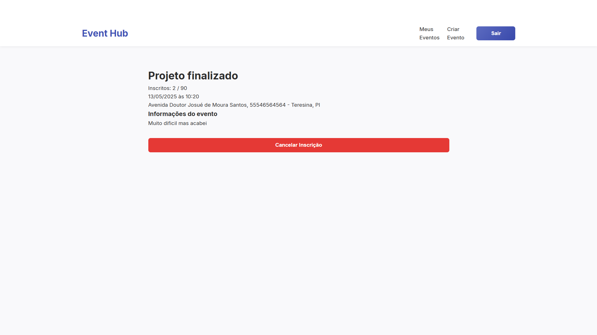
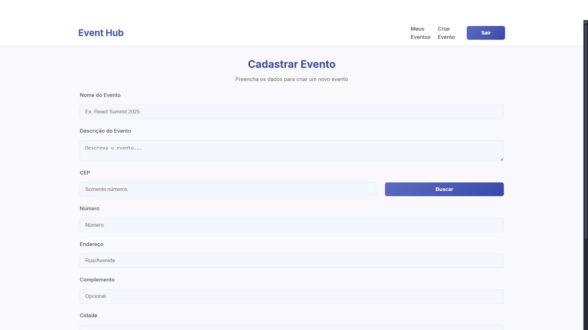
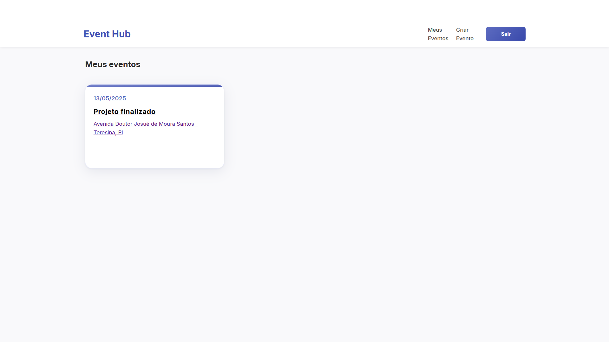

<div align="center">

# 📍 Event Hub

Uma plataforma completa de gerenciamento de eventos com autenticação JWT, construída com **React (SPA)** e **Laravel**.  
Crie, gerencie e participe de eventos com integração automática de endereços via **ViaCEP**.

[![Laravel][Laravel.com]][Laravel-url] [![React][React.js]][React-url] [![JWT][JWT.io]][JWT-url]

</div>

---

## 🚀 Principais Recursos

- Registro e login de usuários com autenticação JWT
- Listagem e gerenciamento de eventos ativos
- Operações CRUD de eventos (restritas ao proprietário)
- Sistema de inscrição em eventos
- Autopreenchimento de endereço via CEP (ViaCEP)
- Validações robustas e mensagens de erro amigáveis
- SPA responsiva com rotas protegidas

## 🛠️ Tecnologias Utilizadas

<div align="center">

| Backend | Frontend | API Externa |
|---------|----------|-------------|
| Laravel 11 | React + Vite | [ViaCEP](https://viacep.com.br) |
| PostgreSQL/MySQL | Axios | |
| JWT Auth | React Router | |

</div>

## ⚙️ Instalação

### Configuração do Backend
```bash
git clone https://github.com/caiorocha7/event-hub
cd event-hub

composer install

cp .env.example .env
php artisan key:generate
php artisan jwt:secret
php artisan migrate
php artisan serve
```

### Configuração do Frontend
```bash
npm install
npm run dev
```

Servidor roda em `http://localhost:8000`

## 🔗 Endpoints

### API (Backend)
| Método | Endpoint | Descrição |
|--------|----------|-----------|
| `POST` | `/api/auth/register` | Registro de usuário |
| `POST` | `/api/auth/login` | Autenticação JWT |
| `GET` | `/api/events` | Listar eventos ativos |
| `POST` | `/api/events` | Criar evento |
| `PUT` | `/api/events/{uuid}` | Atualizar evento |
| `DELETE` | `/api/events/{uuid}` | Deletar evento |
| `POST` | `/api/events/{uuid}/subscribe` | Participar de evento |
| `DELETE` | `/api/events/{uuid}/unsubscribe` | Sair do evento |
| `GET` | `/api/my-events` | Eventos do usuário |

### Rotas Frontend (React)
| Rota | Descrição |
|------|-----------|
| `/` | Página inicial com eventos ativos |
| `/login` | Tela de autenticação |
| `/register` | Tela de cadastro de usuário |
| `/events/create` | Formulário de criação de evento |
| `/events/{uuid}` | Detalhes do evento + inscrição |
| `/my-events` | Eventos do usuário (criados/inscritos) |
| `/events/edit/{uuid}` | Edição de evento (apenas dono) |

📸 Prints do Sistema

<div align="center">

**Cadastro de Usuário**  


**Tela de Login**  


**Página Inicial (Eventos)**  


**Tela de Detalhes do Evento**  


**Acesso a Evento Privado**  


**Cadastro de Novo Evento**  


**Confirmação de Inscrição em Evento**  


**Eventos em que o Usuário Está Inscrito**  


</div>


## 🧪 Testes
```bash
php artisan test --testsuite=Unit
```

<div align="center">

Feito por [Caio Rocha](https://github.com/caiorocha7)

</div>

<!-- MARKDOWN LINKS & IMAGES -->
[Laravel.com]: https://img.shields.io/badge/Laravel-FF2D20?style=for-the-badge&logo=laravel&logoColor=white
[Laravel-url]: https://laravel.com
[React.js]: https://img.shields.io/badge/React-20232A?style=for-the-badge&logo=react&logoColor=61DAFB
[React-url]: https://reactjs.org/
[JWT.io]: https://img.shields.io/badge/JWT-000000?style=for-the-badge&logo=JSON%20web%20tokens&logoColor=white
[JWT-url]: https://jwt.io
